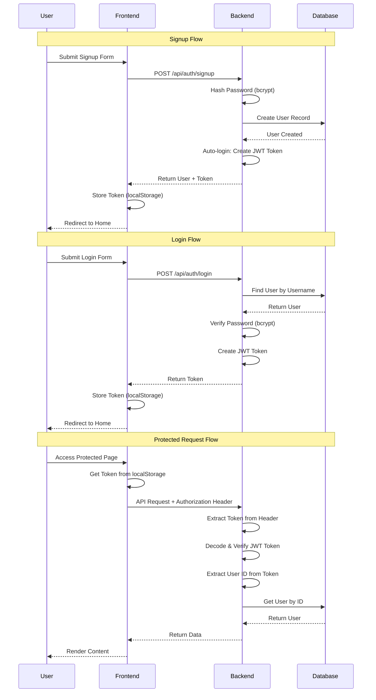
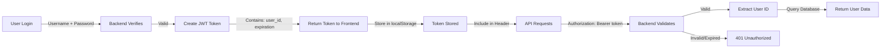
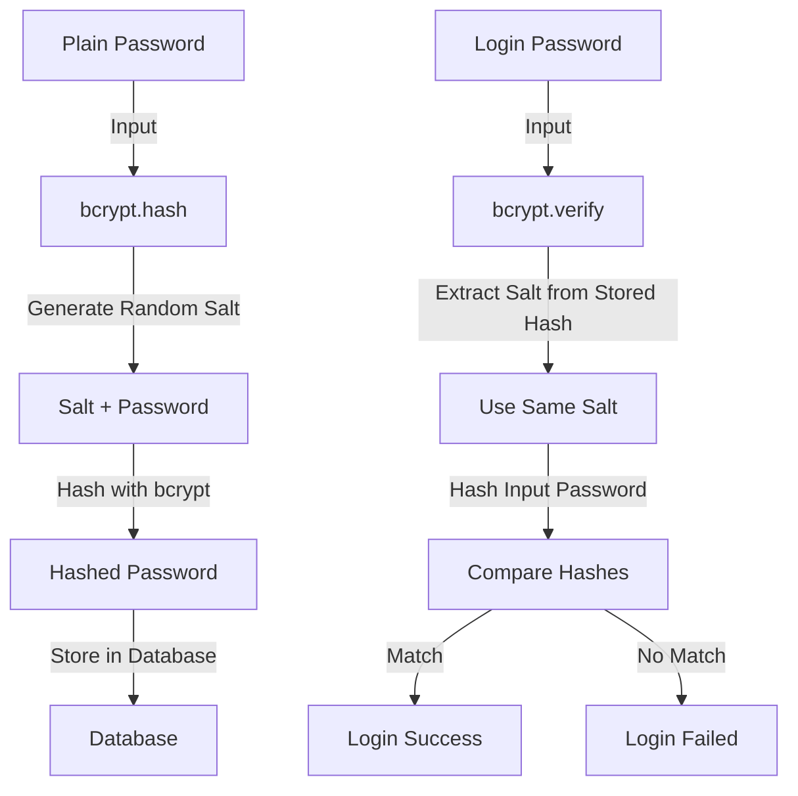

# Authentication Flow

## Complete Authentication Process



## JWT Token Lifecycle



## Password Hashing Process



## Token Structure

```
JWT Token = Header.Payload.Signature

Header:
{
  "alg": "HS256",
  "typ": "JWT"
}

Payload:
{
  "sub": "user-uuid-here",
  "exp": 1700000000
}

Signature:
HMACSHA256(
  base64UrlEncode(header) + "." + base64UrlEncode(payload),
  JWT_SECRET_KEY
)
```

## Security Features

1. **Password Hashing**: bcrypt with automatic salt generation
2. **Token Expiration**: 30 minutes default (configurable)
3. **Token Signature**: HMAC-SHA256 with secret key
4. **HTTPS Recommended**: For production deployments
5. **No Password Storage**: Only hashed passwords in database

