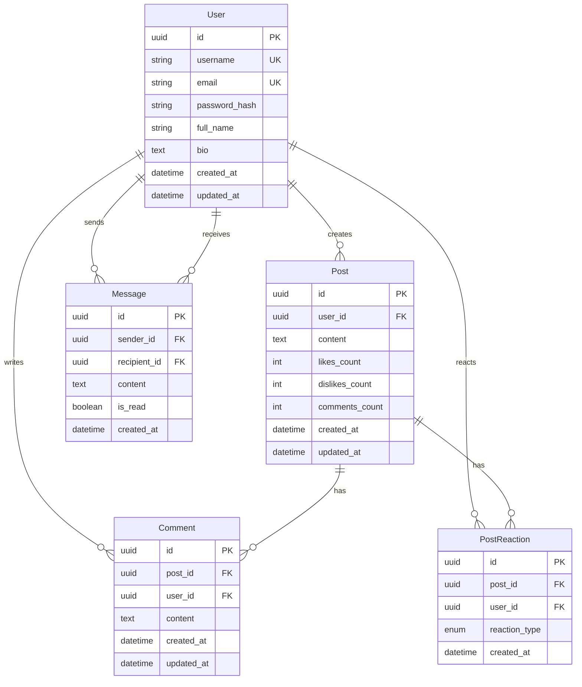

# Data Model Design

## Entity Relationship Diagram



## Database Schema Details

### Users Table
```sql
CREATE TABLE users (
    id UUID PRIMARY KEY,
    username VARCHAR(50) UNIQUE NOT NULL,
    email VARCHAR(100) UNIQUE NOT NULL,
    password_hash VARCHAR(255) NOT NULL,
    full_name VARCHAR(100),
    bio TEXT,
    created_at TIMESTAMP WITH TIME ZONE DEFAULT NOW(),
    updated_at TIMESTAMP WITH TIME ZONE DEFAULT NOW()
);
```

**Indexes:**
- `username` (unique index)
- `email` (unique index)

### Posts Table
```sql
CREATE TABLE posts (
    id UUID PRIMARY KEY,
    user_id UUID NOT NULL REFERENCES users(id),
    content TEXT NOT NULL,
    likes_count INTEGER DEFAULT 0,
    dislikes_count INTEGER DEFAULT 0,
    comments_count INTEGER DEFAULT 0,
    created_at TIMESTAMP WITH TIME ZONE DEFAULT NOW(),
    updated_at TIMESTAMP WITH TIME ZONE DEFAULT NOW()
);
```

**Indexes:**
- `user_id` (foreign key index)
- `created_at` (for sorting)

### Comments Table
```sql
CREATE TABLE comments (
    id UUID PRIMARY KEY,
    post_id UUID NOT NULL REFERENCES posts(id),
    user_id UUID NOT NULL REFERENCES users(id),
    content TEXT NOT NULL,
    created_at TIMESTAMP WITH TIME ZONE DEFAULT NOW(),
    updated_at TIMESTAMP WITH TIME ZONE DEFAULT NOW()
);
```

**Indexes:**
- `post_id` (foreign key index)

### Post Reactions Table
```sql
CREATE TABLE post_reactions (
    id UUID PRIMARY KEY,
    post_id UUID NOT NULL REFERENCES posts(id),
    user_id UUID NOT NULL REFERENCES users(id),
    reaction_type ENUM('like', 'dislike') NOT NULL,
    created_at TIMESTAMP WITH TIME ZONE DEFAULT NOW(),
    UNIQUE(post_id, user_id)
);
```

**Constraints:**
- Unique constraint on `(post_id, user_id)` - one reaction per user per post

### Messages Table
```sql
CREATE TABLE messages (
    id UUID PRIMARY KEY,
    sender_id UUID NOT NULL REFERENCES users(id),
    recipient_id UUID NOT NULL REFERENCES users(id),
    content TEXT NOT NULL,
    is_read BOOLEAN DEFAULT FALSE,
    created_at TIMESTAMP WITH TIME ZONE DEFAULT NOW()
);
```

**Indexes:**
- `sender_id` (foreign key index)
- `recipient_id` (foreign key index)
- `created_at` (for sorting conversations)

## Data Relationships

### One-to-Many Relationships
- **User → Posts**: One user can create many posts
- **User → Comments**: One user can write many comments
- **User → Reactions**: One user can react to many posts
- **User → Messages (sent)**: One user can send many messages
- **User → Messages (received)**: One user can receive many messages
- **Post → Comments**: One post can have many comments
- **Post → Reactions**: One post can have many reactions

### Many-to-Many Relationships
- **Users ↔ Messages**: Users can send/receive messages to/from multiple users
- **Users ↔ Posts (via reactions)**: Users can react to multiple posts

## Denormalization Strategy

### Count Fields
The following count fields are denormalized for performance:
- `posts.likes_count` - Updated when reactions are added/removed
- `posts.dislikes_count` - Updated when reactions are added/removed
- `posts.comments_count` - Updated when comments are added/removed

**Benefits:**
- Faster queries (no need to COUNT() on every request)
- Reduced database load

**Trade-offs:**
- Must maintain consistency when reactions/comments are added/removed
- Slight risk of count drift (can be fixed with periodic reconciliation)

## Data Flow Examples

### Creating a Post
```
User → Frontend → POST /api/posts
  → Backend creates Post record
  → Returns Post with user relationship
```

### Liking a Post
```
User → Frontend → POST /api/posts/{id}/like
  → Backend creates/updates PostReaction
  → Backend increments posts.likes_count
  → Returns updated reaction
```

### Adding a Comment
```
User → Frontend → POST /api/posts/{id}/comments
  → Backend creates Comment record
  → Backend increments posts.comments_count
  → Returns Comment with user relationship
```

### Sending a Message
```
User → Frontend → POST /api/messages
  → Backend creates Message record
  → Returns Message with sender relationship
```

## Search Implementation

Full-text search is implemented using PostgreSQL's LIKE operator:
- Searches in `posts.content` field
- Case-insensitive matching
- Can be enhanced with PostgreSQL full-text search (tsvector) for better performance

## Future Enhancements

1. **Full-Text Search**: Implement PostgreSQL tsvector for better search
2. **Image Support**: Add media table for post images
3. **Notifications**: Add notification table for user alerts
4. **Post Tags**: Add tagging system for posts
5. **User Follows**: Add follow/follower relationships

