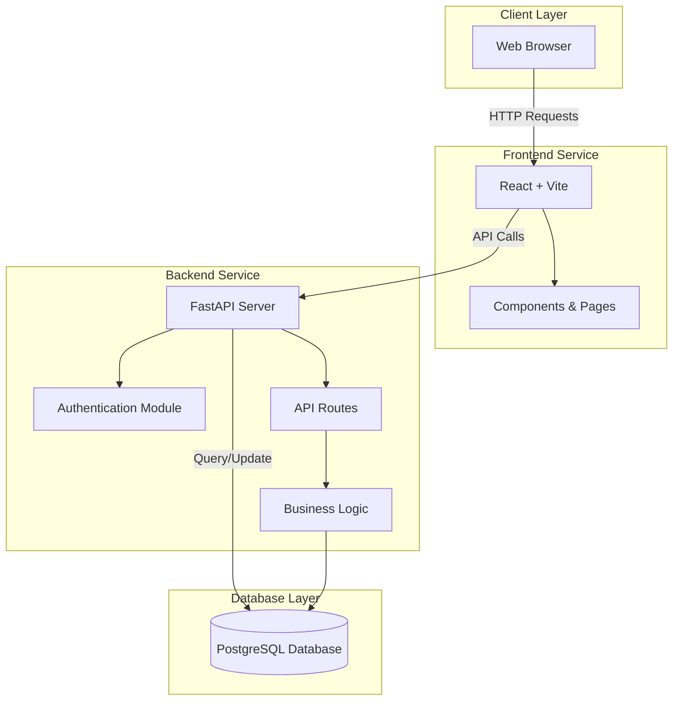
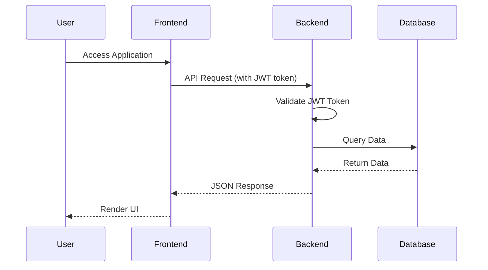

# System Architecture

## High-Level Architecture



## Service Communication Flow



## Technology Stack

### Frontend
- **Framework**: React 18+
- **Build Tool**: Vite
- **HTTP Client**: Axios
- **Routing**: React Router
- **State Management**: React Context API

### Backend
- **Framework**: FastAPI (Python)
- **ORM**: SQLAlchemy
- **Database**: PostgreSQL 15
- **Authentication**: JWT (python-jose)
- **Password Hashing**: bcrypt (via passlib)

### Infrastructure
- **Containerization**: Docker & Docker Compose
- **Database**: PostgreSQL (containerized)

## API Endpoints Overview

```
/api/auth/
  ├── POST /signup          - Create new user account
  ├── POST /login           - Authenticate and get token
  └── GET  /me             - Get current user info

/api/users/
  ├── GET  /               - List all users
  ├── GET  /{user_id}      - Get user profile
  ├── GET  /{user_id}/posts - Get user's posts
  └── PUT  /me             - Update own profile

/api/posts/
  ├── GET    /             - Get all posts
  ├── GET    /{post_id}    - Get single post
  ├── POST   /             - Create post
  ├── PUT    /{post_id}    - Update post
  ├── DELETE /{post_id}    - Delete post
  ├── POST   /{post_id}/like - Like post
  ├── POST   /{post_id}/dislike - Dislike post
  └── DELETE /{post_id}/reaction - Remove reaction

/api/posts/{post_id}/comments/
  ├── GET    /             - Get comments
  ├── POST   /             - Add comment
  ├── PUT    /{comment_id} - Update comment
  └── DELETE /{comment_id} - Delete comment

/api/search/
  └── GET  /?q={keyword}   - Search posts

/api/messages/
  ├── GET    /             - Get conversations
  ├── GET    /{user_id}   - Get conversation
  ├── POST   /             - Send message
  ├── PUT    /{message_id}/read - Mark as read
  └── GET    /unread-count - Get unread count
```

